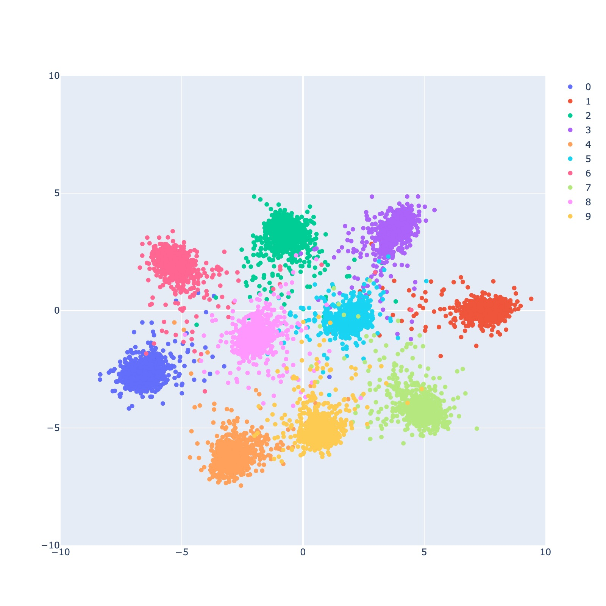

# Siamese CNN Network on MNIST Dataset (Pytorch)

Author: Lei Mao, Malek Ibrahim

Date: 05/31/2023

See [here](https://malekinho8.github.io/Siamese_Network_MNIST/index.html) for an interactive visualization!



## Description

This is a practice of Siamese Network implementation on simple MNIST dataset, trying to represent the handwriting digit images using a two dimensional array. The Siamese Network we used in this model is a 2-layer CNN (with shared weights).

## Requirements

* Python 3.10

## Dependencies

* Pytorch
* Torchvision
* Plotly
* Matplotlib 2.0
* Numpy 1.13

## Usage

The Torchvision package already includes the MNIST dataset. To load the dataset, train the Siamese Network with the MNIST training set, and output the two dimensional embeding features of the MNIST test set to file, simply run:

```shell
python siamese_run_cnn.py
```
The embeding features will be stored in a Pytorch file every 10 epochs `embed_ep:{epoch_number}.pt` and the best model according to loss on the test dataset will be saved in the root directory as `siamese_best.pt`.


To visualize the two dimensional embeding features of the MNIST test set with its ground truth labels, simply run:

```shell
python visualize.py
```
The visualization will be saved as "embed.jpeg".

## References

https://www.tensorflow.org/versions/r0.12/how_tos/variable_scope/

https://github.com/ywpkwon/siamese_tf_mnist/blob/master/inference.py
