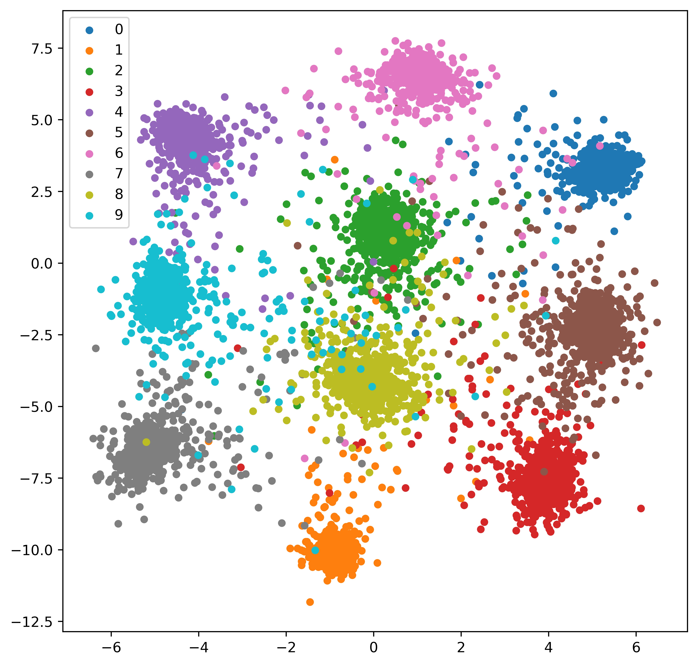

# Train Siamese Network on MNIST Dataset

Author: Lei Mao

Date: 10/30/2017

## Description

This is a practice of Siamese Network implementation on simple MNIST dataset, trying to represent the handwriting digit images using a two dimensional array. The Siamese Network we used in this model is a three-layer fully connected neural network with shared weights.

## Requirements

* Python 3.6

## Dependencies

* TensorFlow 1.3
* Matplotlib 2.0
* Numpy 1.13

## Usage

The TensorFlow package already includes the MNIST dataset. To load the dataset, train the Siamese Network with the MNIST training set, and output the two dimensional embeding features of the MNIST test set to file, simply run:

```shell
python siamese_run.py
```
The embeding features will be stored in file "embed.txt" and the trained model will be save in "model" directory.


To visualize the two dimensional embeding features of the MNIST test set with its ground truth labels, simply run:
```shell
python visualize.py
```
The visualization will be saved as "embed.jpeg".

## Result



## References

https://www.tensorflow.org/versions/r0.12/how_tos/variable_scope/

https://github.com/ywpkwon/siamese_tf_mnist/blob/master/inference.py